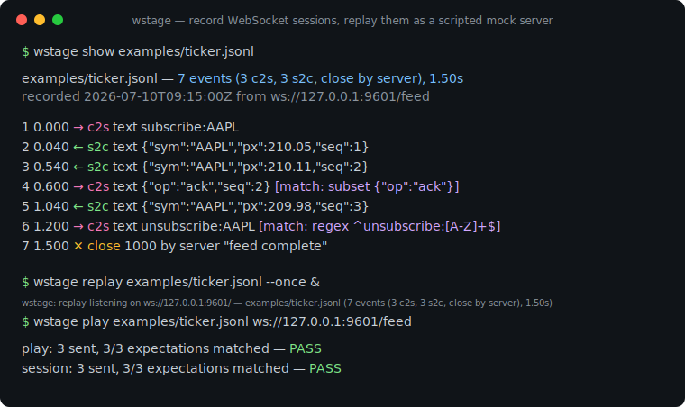
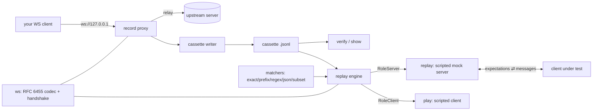

# wstage

[English](README.md) | [中文](README.zh.md) | [日本語](README.ja.md)

[](LICENSE) [](go.mod) [](CHANGELOG.md)  [](CONTRIBUTING.md)

**wstage：WebSocket セッションをカセットファイルに録画し、スクリプト化されたモックサーバーとして再生するオープンソース・ゼロ依存の CLI —— リアルタイムクライアントに VCR 式テストを。メッセージ単位の期待値と、引用可能な不一致の証拠つき。**



```bash
git clone https://github.com/JaydenCJ/wstage && cd wstage
CGO_ENABLED=0 go build -o wstage ./cmd/wstage    # one static binary, stdlib only
```

> プレリリース：v0.1.0 はまだどのレジストリにも公開されていません。上記の手順でソースからビルドしてください（Go ≥1.22 なら可）。

## なぜ wstage？

HTTP クライアントには 10 年前からカセットテストがあります——実際のやり取りを一度録画し、以後は永久に再生、ずれたら即失敗。WebSocket クライアントにはまだありません：テストには本物のバックエンドを立てる（遅い・不安定・認証が要る）か、テストごとにモックサーバーを手書きする（いつの間にか本番と似なくなる）のが常でした。汎用ツールもこの穴を埋めていません：websocat は優れた対話パイプですが「録画されたセッション」や「アサーション」という概念を持たず、HTTP カセットライブラリはリクエスト/レスポンス止まりで、順序を持つ双方向メッセージストリームを表現できません。wstage はセッションそのものをフィクスチャとして扱います：`record` は実セッションをプロキシ経由で人間可読な JSON Lines カセットに書き出し、`replay` はそのカセットをスクリプト化モックサーバーとして提供しつつクライアントの各メッセージを録画内容に対して*検証*し（exact・prefix・regex・JSON 等価・JSON サブセット）、`play` は同じカセットをクライアント側から駆動します——録画は構成上、自己検証的なのです。台本を外れたクライアントは失敗した期待値番号つきのコード 1008 で切断され、`--once` は一回の再生を終了コードつきのテストに変えます。

| | wstage | websocat | HTTP カセットライブラリ（VCR/nock） | 手書きモックサーバー |
|---|---|---|---|---|
| 実 WebSocket セッションをファイルへ録画 | ✅ | ❌ パイプのみ | ❌ HTTP のみ | ❌ |
| アサーションつきモックサーバーとして再生 | ✅ | ❌ | ❌ | テストごとに手作業 |
| メッセージ単位のマッチ規則（regex/JSON サブセット） | ✅ | ❌ | リクエストマッチャーのみ | 手作業 |
| テストハーネス向けの終了コード判定 | ✅ | ❌ | ✅ | 手作業 |
| 言語非依存（どのクライアントスタックもモック可） | ✅ | ✅ | ❌ 単一ランタイムに拘束 | 場合による |
| ランタイム依存 | 0 | Rust crates | Python/JS 依存 | 該当なし |

<sub>依存数の確認は 2026-07-13：wstage は Go 標準ライブラリのみをインポート——自前の RFC 6455 実装を含みます；websocat 1.13 のビルドには 100+ crates；vcrpy は PyPI から 4 つのランタイムパッケージを取得。</sub>

## 特長

- **シムではなくプロキシで録画** —— クライアントを wstage へ、wstage を本物の ws:// バックエンドへ向けるだけ。双方向の全メッセージとクローズハンドシェイクが diff しやすい JSON Lines カセットに一行ずつ書き込まれます。
- **再生はエコーではなく本物のアサーション** —— 録画されたクライアントメッセージの一つひとつが期待値。台本外のクライアントは失敗した期待値番号つきの 1008 で切断され、`replay --once` は 0/1 で終了するのでテストハーネスに直結できます。
- **完全一致が不適切な場面にはスクリプト化マッチ** —— タイムスタンプ・id・トークンは実行ごとに揺れるため、期待値には `prefix`、`regex`、`json`（構造等価）、`subset`（追加キー許容、JSON パスで不一致を報告）、`any` を指定できます。
- **自己検証するカセット** —— `play` はカセットのクライアント側から任意のサーバーを駆動。同じファイルの replay と play は互いに PASS しなければならず、smoke テストが record → replay → PASS のループを証明します。
- **既定で決定的、必要なら現実的に** —— 再生は既定で即時送信（`--speed 0`）。`--speed 1` は録画時のペースを再現、`--speed 0.1` は 10 倍に圧縮します。
- **正直なトランスクリプト** —— `show` はどのカセットもタイムスタンプとマッチ規則つきの会話として描画。`verify` はソケットを一切開かずに形式・期待値・クローズコード・タイムラインを検査します。
- **ゼロ依存・完全オフライン** —— RFC 6455 のフレーミング・マスキング・ハンドシェイクはこのリポジトリ内にあります。サーバーは既定で 127.0.0.1 にバインドし、指名していない相手には決して接続せず、テレメトリも一切ありません。

## クイックスタート

```bash
# no backend needed for a first run: replay the bundled cassette as a mock
# server, then drive it with the scripted client from the same recording
./wstage replay examples/ticker.jsonl --once &
./wstage play examples/ticker.jsonl ws://127.0.0.1:9601/feed
```

実際に取得した出力：

```text
wstage: replay listening on ws://127.0.0.1:9601/ — examples/ticker.jsonl (7 events (3 c2s, 3 s2c, close by server), 1.50s)
play: 3 sent, 3/3 expectations matched — PASS
session: 3 sent, 3/3 expectations matched — PASS
```

モックサーバーが何をするかを確認（`wstage show`、実際の出力）：

```text
examples/ticker.jsonl — 7 events (3 c2s, 3 s2c, close by server), 1.50s
recorded 2026-07-10T09:15:00Z from ws://127.0.0.1:9601/feed

   1    0.000  → c2s   text   subscribe:AAPL
   2    0.040  ← s2c   text   {"sym":"AAPL","px":210.05,"seq":1}
   3    0.540  ← s2c   text   {"sym":"AAPL","px":210.11,"seq":2}
   4    0.600  → c2s   text   {"op":"ack","seq":2}   [match: subset {"op":"ack"}]
   5    1.040  ← s2c   text   {"sym":"AAPL","px":209.98,"seq":3}
   6    1.200  → c2s   text   unsubscribe:AAPL   [match: regex ^unsubscribe:[A-Z]+$]
   7    1.500  ✕ close        1000 by server "feed complete"
```

自分のバックエンドを一度録画すれば、以後はずっと録画に対してテストできます：

```bash
wstage record ws://127.0.0.1:8080/feed --out feed.jsonl   # client connects to :9601
wstage verify feed.jsonl
wstage replay feed.jsonl --once                            # the mock for your test run
```

## カセット形式

1 行につき 1 つの JSON オブジェクト：`{"wstage":1}` ヘッダーの後に録画順のイベントが並びます——完全な仕様は [docs/cassette-format.md](docs/cassette-format.md)。期待値はデータなので、テキストエディタで編集できます：

```json
{"t":0.6,"dir":"c2s","type":"text","data":"{\"op\":\"ack\",\"seq\":2}","match":"subset","expect":"{\"op\":\"ack\"}"}
```

| マッチモード | 合格条件 | 典型的な用途 |
|---|---|---|
| `exact`（既定） | ペイロードがバイト単位で一致 | 安定したプロトコルコマンド |
| `prefix` | ペイロードが `expect` で始まる | 末尾に id/token |
| `regex` | RE2 パターンが一致 | 構造的だが可変のテキスト |
| `json` | JSON の構造等価 | キー順・空白の揺れ |
| `subset` | `expect` ⊆ メッセージ（追加キー許容） | フィールドを足すクライアント |
| `any` | 常に合格（メッセージを 1 件消費） | 関心のないノイズ |

## CLI リファレンス

`wstage <record|replay|play|show|verify|version>` —— 終了コード：0 正常、1 期待値/検証の失敗、2 使い方エラー、3 実行時エラー。

| フラグ | 既定値 | 効果 |
|---|---|---|
| `--listen`（record/replay） | `127.0.0.1:9601` | 待ち受けアドレス。`:0` で空きポートを選んで表示 |
| `--out`（record） | 必須 | 書き出すカセットファイル。イベントごとにフラッシュ |
| `--name`（record） | 出力ファイルのベース名 | ヘッダーに記録するカセット名 |
| `--once`（replay） | オフ | 1 セッションだけ提供し、判定結果で終了 |
| `--lenient`（replay/play） | オフ | 不一致を報告しつつセッションを続行 |
| `--speed`（replay/play） | `0` | 録画間隔への倍率。0 = 遅延なし |
| `--timeout`（全ソケット） | `30` | 接続と各読み取りのタイムアウト秒数。`0` で無効（record は接続のみ） |

## 検証

このリポジトリは CI を持ちません。上記の主張はすべてローカル実行で検証されます：

```bash
go test ./...            # 92 deterministic tests, loopback only, < 5 s
bash scripts/smoke.sh    # end-to-end CLI loop, prints SMOKE OK
```

## アーキテクチャ



## ロードマップ

- [x] v0.1.0 —— リポジトリ内蔵の RFC 6455 スタック、JSON Lines カセット、録画プロキシ、6 種のマッチモードを持つスクリプト化 replay/play、show/verify、92 テスト + smoke スクリプト
- [ ] 録画プロキシの `wss://`（TLS）アップストリーム対応
- [ ] 複数セッションカセットと、再生時の順次/並列セッション選択
- [ ] ping の録画と、keepalive テスト向けのサーバー発 ping のスクリプト化
- [ ] レイテンシジッター注入（`--speed` にランダムな揺らぎ）による負荷寄りの実行
- [ ] カセットの秘匿化ヘルパー（レビュー時ではなく録画時にトークンをマスク）

全リストは [open issues](https://github.com/JaydenCJ/wstage/issues) を参照。

## コントリビュート

Issue・ディスカッション・PR を歓迎します —— ローカルの作業手順（フォーマット、vet、テスト、`SMOKE OK`）は [CONTRIBUTING.md](CONTRIBUTING.md) を参照。入門向けタスクには [good first issue](https://github.com/JaydenCJ/wstage/issues?q=is%3Aissue+is%3Aopen+label%3A%22good+first+issue%22) のラベルがあり、設計の議論は [Discussions](https://github.com/JaydenCJ/wstage/discussions) で行っています。

## ライセンス

[MIT](LICENSE)
