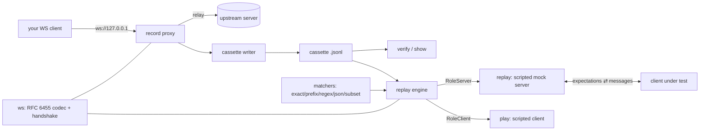

# wstage

[English](README.md) | [中文](README.zh.md) | [日本語](README.ja.md)

[](LICENSE) [](go.mod) [](CHANGELOG.md)  [](CONTRIBUTING.md)

**wstage：an open-source, zero-dependency CLI that records WebSocket sessions to cassette files and replays them as a scripted mock server — VCR-style testing for realtime clients, with per-message expectations and quotable mismatch evidence.**


```bash
git clone https://github.com/JaydenCJ/wstage && cd wstage
CGO_ENABLED=0 go build -o wstage ./cmd/wstage    # one static binary, stdlib only
```

> Pre-release: v0.1.0 is not tagged on a package registry yet; build from source as above (any Go ≥1.22).

## Why wstage?

HTTP clients have had cassette testing for a decade — record a real exchange once, replay it forever, fail loudly on drift. WebSocket clients still don't: testing them usually means standing up the real backend (slow, flaky, needs credentials) or hand-writing a mock server per test (which silently stops resembling production). The generic tools don't close the gap either: websocat is a superb interactive pipe but has no notion of a recorded session or an assertion, and the HTTP cassette libraries stop at request/response, which cannot express an ordered, bidirectional message stream. wstage treats the session itself as the fixture: `record` proxies one live session into a human-readable JSON Lines cassette, `replay` serves that cassette as a scripted mock server that *asserts* every client message against the recording (exact, prefix, regex, JSON-equal, or JSON-subset), and `play` drives the same cassette from the client side — so a recording is self-verifying by construction. Off-script clients are closed with code 1008 naming the failed expectation, and `--once` turns a replay into a test with an exit code.

| | wstage | websocat | HTTP cassette libs (VCR/nock) | hand-rolled mock server |
|---|---|---|---|---|
| Record a live WebSocket session to a file | ✅ | ❌ pipe only | ❌ HTTP only | ❌ |
| Replay as a mock server with assertions | ✅ | ❌ | ❌ | manual, per test |
| Per-message match rules (regex/JSON subset) | ✅ | ❌ | request matchers only | manual |
| Exit-code verdict for test harnesses | ✅ | ❌ | ✅ | manual |
| Language-agnostic (mock any client stack) | ✅ | ✅ | ❌ bound to one runtime | depends |
| Runtime dependencies | 0 | Rust crates | Python/JS deps | n/a |

<sub>Dependency counts checked 2026-07-13: wstage imports the Go standard library only — including its own RFC 6455 implementation; websocat 1.13 builds with 100+ crates; vcrpy pulls 4 runtime packages from PyPI.</sub>

## Features

- **Record through a proxy, not a shim** — point your client at wstage, wstage at the real ws:// backend; every message in both directions and the closing handshake land in a diff-friendly JSON Lines cassette, flushed line by line.
- **Replay is a real assertion, not an echo** — each recorded client message is an expectation; off-script clients are closed with 1008 and the failed expectation number, and `replay --once` exits 0/1 so it drops straight into a test harness.
- **Scripted matching where exactness is wrong** — timestamps, ids and tokens drift between runs, so expectations can be `prefix`, `regex`, `json` (structural equality), `subset` (extra keys allowed, JSON-path mismatch reports), or `any`.
- **Self-verifying cassettes** — `play` drives any server from the cassette's client side; a replay and a play of the same file must PASS against each other, and the smoke test proves the loop record → replay → PASS.
- **Deterministic by default, realistic on demand** — replay sends instantly (`--speed 0`); `--speed 1` reproduces recorded pacing, `--speed 0.1` compresses it tenfold.
- **Honest transcripts** — `show` renders any cassette as a timestamped conversation with its match rules; `verify` lint-checks format, expectations, close codes and timeline without opening a socket.
- **Zero dependencies, fully offline** — the RFC 6455 framing, masking and handshake live in this repository; servers bind 127.0.0.1 by default, nothing is dialed that you didn't name, no telemetry, ever.

## Quickstart

```bash
# no backend needed for a first run: replay the bundled cassette as a mock
# server, then drive it with the scripted client from the same recording
./wstage replay examples/ticker.jsonl --once &
./wstage play examples/ticker.jsonl ws://127.0.0.1:9601/feed
```

Real captured output:

```text
wstage: replay listening on ws://127.0.0.1:9601/ — examples/ticker.jsonl (7 events (3 c2s, 3 s2c, close by server), 1.50s)
play: 3 sent, 3/3 expectations matched — PASS
session: 3 sent, 3/3 expectations matched — PASS
```

Inspect what the mock server will do (`wstage show`, real output):

```text
examples/ticker.jsonl — 7 events (3 c2s, 3 s2c, close by server), 1.50s
recorded 2026-07-10T09:15:00Z from ws://127.0.0.1:9601/feed

   1    0.000  → c2s   text   subscribe:AAPL
   2    0.040  ← s2c   text   {"sym":"AAPL","px":210.05,"seq":1}
   3    0.540  ← s2c   text   {"sym":"AAPL","px":210.11,"seq":2}
   4    0.600  → c2s   text   {"op":"ack","seq":2}   [match: subset {"op":"ack"}]
   5    1.040  ← s2c   text   {"sym":"AAPL","px":209.98,"seq":3}
   6    1.200  → c2s   text   unsubscribe:AAPL   [match: regex ^unsubscribe:[A-Z]+$]
   7    1.500  ✕ close        1000 by server "feed complete"
```

Record your own backend once, then test against the recording forever:

```bash
wstage record ws://127.0.0.1:8080/feed --out feed.jsonl   # client connects to :9601
wstage verify feed.jsonl
wstage replay feed.jsonl --once                            # the mock for your test run
```

## Cassette format

One JSON object per line: a `{"wstage":1}` header, then events in recorded order — full specification in [docs/cassette-format.md](docs/cassette-format.md). Expectations are data, so you edit them with a text editor:

```json
{"t":0.6,"dir":"c2s","type":"text","data":"{\"op\":\"ack\",\"seq\":2}","match":"subset","expect":"{\"op\":\"ack\"}"}
```

| Match mode | Passes when | Typical use |
|---|---|---|
| `exact` (default) | payload byte-identical | stable protocol commands |
| `prefix` | payload starts with `expect` | ids/tokens in the tail |
| `regex` | RE2 pattern matches | structured but variable text |
| `json` | structural JSON equality | key order / whitespace drift |
| `subset` | `expect` ⊆ message (extra keys ok) | clients that add fields |
| `any` | always (consumes one message) | noise you don't care about |

## CLI reference

`wstage <record|replay|play|show|verify|version>` — exit codes: 0 ok, 1 expectation/verify failure, 2 usage error, 3 runtime error.

| Flag | Default | Effect |
|---|---|---|
| `--listen` (record/replay) | `127.0.0.1:9601` | address to serve on; `:0` picks a free port and prints it |
| `--out` (record) | required | cassette file to write, flushed per event |
| `--name` (record) | output basename | cassette name stored in the header |
| `--once` (replay) | off | serve one session, exit with its verdict |
| `--lenient` (replay/play) | off | report mismatches but keep the session going |
| `--speed` (replay/play) | `0` | multiplier on recorded gaps; 0 = no delays |
| `--timeout` (all sockets) | `30` | dial and per-read timeout in seconds; `0` disables (record: dial only) |

## Verification

This repository ships no CI; every claim above is verified by local runs:

```bash
go test ./...            # 92 deterministic tests, loopback only, < 5 s
bash scripts/smoke.sh    # end-to-end CLI loop, prints SMOKE OK
```

## Architecture



## Roadmap

- [x] v0.1.0 — in-repo RFC 6455 stack, JSON Lines cassettes, record proxy, scripted replay/play with six match modes, show/verify, 92 tests + smoke script
- [ ] `wss://` (TLS) upstreams for the record proxy
- [ ] Multi-session cassettes and sequential/parallel session selection in replay
- [ ] Recording pings and scripted server-initiated pings for keepalive tests
- [ ] Latency jitter injection (`--speed` with randomized spread) for soak-style runs
- [ ] Cassette redaction helpers (mask tokens on record, not in review)

See the [open issues](https://github.com/JaydenCJ/wstage/issues) for the full list.

## Contributing

Issues, discussions and pull requests are welcome — see [CONTRIBUTING.md](CONTRIBUTING.md) for the local workflow (format, vet, tests, `SMOKE OK`). Good entry points are labelled [good first issue](https://github.com/JaydenCJ/wstage/issues?q=is%3Aissue+is%3Aopen+label%3A%22good+first+issue%22), and design questions live in [Discussions](https://github.com/JaydenCJ/wstage/discussions).

## License

[MIT](LICENSE)
