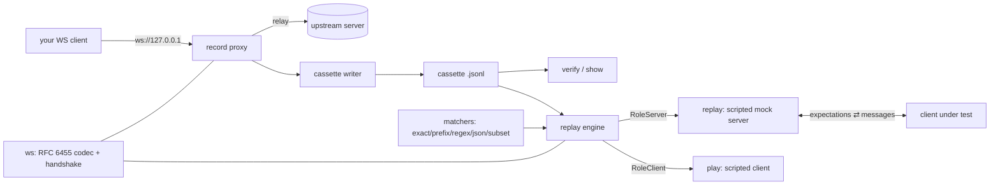

# wstage

[English](README.md) | [中文](README.zh.md) | [日本語](README.ja.md)

[](LICENSE) [](go.mod) [](CHANGELOG.md)  [](CONTRIBUTING.md)

**wstage：开源、零依赖的 CLI，把 WebSocket 会话录制成卡带文件，再作为脚本化 mock 服务器回放 —— 为实时客户端带来 VCR 式测试，逐消息断言，不匹配时给出可引用的证据。**


```bash
git clone https://github.com/JaydenCJ/wstage && cd wstage
CGO_ENABLED=0 go build -o wstage ./cmd/wstage    # one static binary, stdlib only
```

> 预发布：v0.1.0 尚未发布到任何包仓库；请按上述方式从源码构建（Go ≥1.22 均可）。

## 为什么选 wstage？

HTTP 客户端十年前就有了卡带测试——真实交互录一次、永久回放、漂移即报错。WebSocket 客户端至今没有：测试它们通常要么架起真实后端（慢、易抖、要凭证），要么每个测试手写一个 mock 服务器（它会悄悄地不再像生产环境）。通用工具也没有补上这个缺口：websocat 是出色的交互式管道，但没有"录制的会话"和"断言"的概念；HTTP 卡带库止步于请求/响应，无法表达有序的双向消息流。wstage 把会话本身当作 fixture：`record` 把一次真实会话经代理写成人类可读的 JSON Lines 卡带，`replay` 把卡带作为脚本化 mock 服务器提供服务，并对客户端的每条消息按录制内容*断言*（exact、prefix、regex、JSON 相等或 JSON 子集），`play` 则从客户端一侧驱动同一盘卡带——因此录制结果在构造上就是自校验的。脱稿的客户端会被以 1008 码关闭并指明失败的期望编号，`--once` 让一次回放变成带退出码的测试。

| | wstage | websocat | HTTP 卡带库（VCR/nock） | 手写 mock 服务器 |
|---|---|---|---|---|
| 把实时 WebSocket 会话录制到文件 | ✅ | ❌ 仅管道 | ❌ 仅 HTTP | ❌ |
| 作为带断言的 mock 服务器回放 | ✅ | ❌ | ❌ | 每个测试手工写 |
| 逐消息匹配规则（regex/JSON 子集） | ✅ | ❌ | 仅请求匹配器 | 手工 |
| 供测试框架使用的退出码判定 | ✅ | ❌ | ✅ | 手工 |
| 语言无关（可 mock 任何客户端栈） | ✅ | ✅ | ❌ 绑定单一运行时 | 视情况 |
| 运行时依赖 | 0 | Rust crates | Python/JS 依赖 | 不适用 |

<sub>依赖数核对于 2026-07-13：wstage 只导入 Go 标准库——包括自带的 RFC 6455 实现；websocat 1.13 构建需 100+ crates；vcrpy 从 PyPI 拉取 4 个运行时包。</sub>

## 特性

- **经代理录制，而非打桩** —— 客户端指向 wstage，wstage 指向真实 ws:// 后端；双向每条消息与关闭握手都写入 diff 友好的 JSON Lines 卡带，逐行落盘。
- **回放是真断言，不是回声** —— 每条录制的客户端消息都是一个期望；脱稿的客户端会被以 1008 码关闭并附失败期望编号，`replay --once` 以 0/1 退出，可直接嵌进测试框架。
- **在"逐字节相等"不合适处用脚本化匹配** —— 时间戳、id 和 token 每次运行都会漂移，期望可用 `prefix`、`regex`、`json`（结构相等）、`subset`（允许多余键，按 JSON 路径报告不匹配）或 `any`。
- **卡带自校验** —— `play` 从卡带的客户端一侧驱动任何服务器；同一文件的 replay 与 play 必须互相 PASS，冒烟测试证明 record → replay → PASS 的闭环。
- **默认确定性，按需还原真实节奏** —— 回放默认即时发送（`--speed 0`）；`--speed 1` 复现录制节奏，`--speed 0.1` 压缩十倍。
- **诚实的转录** —— `show` 把任何卡带渲染成带时间戳与匹配规则的对话；`verify` 不开任何 socket 即校验格式、期望、关闭码与时间线。
- **零依赖、完全离线** —— RFC 6455 的分帧、掩码与握手就在本仓库中；服务器默认绑定 127.0.0.1，绝不主动连接你未指名的地址，永无遥测。

## 快速上手

```bash
# no backend needed for a first run: replay the bundled cassette as a mock
# server, then drive it with the scripted client from the same recording
./wstage replay examples/ticker.jsonl --once &
./wstage play examples/ticker.jsonl ws://127.0.0.1:9601/feed
```

真实捕获的输出：

```text
wstage: replay listening on ws://127.0.0.1:9601/ — examples/ticker.jsonl (7 events (3 c2s, 3 s2c, close by server), 1.50s)
play: 3 sent, 3/3 expectations matched — PASS
session: 3 sent, 3/3 expectations matched — PASS
```

查看 mock 服务器将做什么（`wstage show`，真实输出）：

```text
examples/ticker.jsonl — 7 events (3 c2s, 3 s2c, close by server), 1.50s
recorded 2026-07-10T09:15:00Z from ws://127.0.0.1:9601/feed

   1    0.000  → c2s   text   subscribe:AAPL
   2    0.040  ← s2c   text   {"sym":"AAPL","px":210.05,"seq":1}
   3    0.540  ← s2c   text   {"sym":"AAPL","px":210.11,"seq":2}
   4    0.600  → c2s   text   {"op":"ack","seq":2}   [match: subset {"op":"ack"}]
   5    1.040  ← s2c   text   {"sym":"AAPL","px":209.98,"seq":3}
   6    1.200  → c2s   text   unsubscribe:AAPL   [match: regex ^unsubscribe:[A-Z]+$]
   7    1.500  ✕ close        1000 by server "feed complete"
```

把你自己的后端录一次，之后永远对着录制结果测试：

```bash
wstage record ws://127.0.0.1:8080/feed --out feed.jsonl   # client connects to :9601
wstage verify feed.jsonl
wstage replay feed.jsonl --once                            # the mock for your test run
```

## 卡带格式

每行一个 JSON 对象：`{"wstage":1}` 头部，随后按录制顺序排列事件——完整规范见 [docs/cassette-format.md](docs/cassette-format.md)。期望就是数据，用文本编辑器即可修改：

```json
{"t":0.6,"dir":"c2s","type":"text","data":"{\"op\":\"ack\",\"seq\":2}","match":"subset","expect":"{\"op\":\"ack\"}"}
```

| 匹配模式 | 通过条件 | 典型用途 |
|---|---|---|
| `exact`（默认） | 载荷逐字节一致 | 稳定的协议命令 |
| `prefix` | 载荷以 `expect` 开头 | 尾部带 id/token |
| `regex` | RE2 模式匹配 | 结构化但可变的文本 |
| `json` | JSON 结构相等 | 键序 / 空白漂移 |
| `subset` | `expect` ⊆ 消息（允许多余键） | 会加字段的客户端 |
| `any` | 恒通过（消费一条消息） | 你不关心的噪声 |

## CLI 参考

`wstage <record|replay|play|show|verify|version>` —— 退出码：0 正常，1 期望/校验失败，2 用法错误，3 运行时错误。

| 参数 | 默认值 | 作用 |
|---|---|---|
| `--listen`（record/replay） | `127.0.0.1:9601` | 监听地址；`:0` 自动选空闲端口并打印 |
| `--out`（record） | 必填 | 要写入的卡带文件，逐事件落盘 |
| `--name`（record） | 输出文件基名 | 写入头部的卡带名 |
| `--once`（replay） | 关 | 只服务一个会话，按判定结果退出 |
| `--lenient`（replay/play） | 关 | 报告不匹配但继续会话 |
| `--speed`（replay/play） | `0` | 录制间隔的倍率；0 = 不延迟 |
| `--timeout`（所有 socket） | `30` | 拨号与单次读取的超时秒数；`0` 表示不限（record 仅用于拨号） |

## 验证

本仓库不带 CI；上述每一条声明都由本地运行验证：

```bash
go test ./...            # 92 deterministic tests, loopback only, < 5 s
bash scripts/smoke.sh    # end-to-end CLI loop, prints SMOKE OK
```

## 架构



## 路线图

- [x] v0.1.0 —— 仓库内置 RFC 6455 协议栈、JSON Lines 卡带、录制代理、六种匹配模式的脚本化 replay/play、show/verify、92 个测试 + 冒烟脚本
- [ ] 录制代理支持 `wss://`（TLS）上游
- [ ] 多会话卡带，以及回放时的顺序/并行会话选择
- [ ] 录制 ping 与脚本化的服务器主动 ping，用于 keepalive 测试
- [ ] 延迟抖动注入（`--speed` 加随机散布），用于浸泡式运行
- [ ] 卡带脱敏助手（录制时掩码 token，而不是评审时）

完整列表见 [open issues](https://github.com/JaydenCJ/wstage/issues)。

## 参与贡献

欢迎 issue、讨论与 PR —— 本地工作流（格式化、vet、测试、`SMOKE OK`）见 [CONTRIBUTING.md](CONTRIBUTING.md)。入门任务标注为 [good first issue](https://github.com/JaydenCJ/wstage/issues?q=is%3Aissue+is%3Aopen+label%3A%22good+first+issue%22)，设计讨论在 [Discussions](https://github.com/JaydenCJ/wstage/discussions)。

## 许可证

[MIT](LICENSE)
